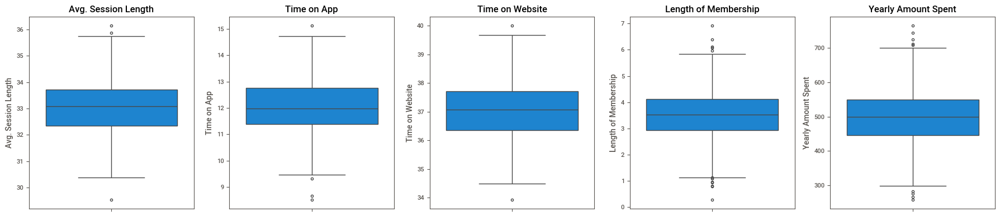
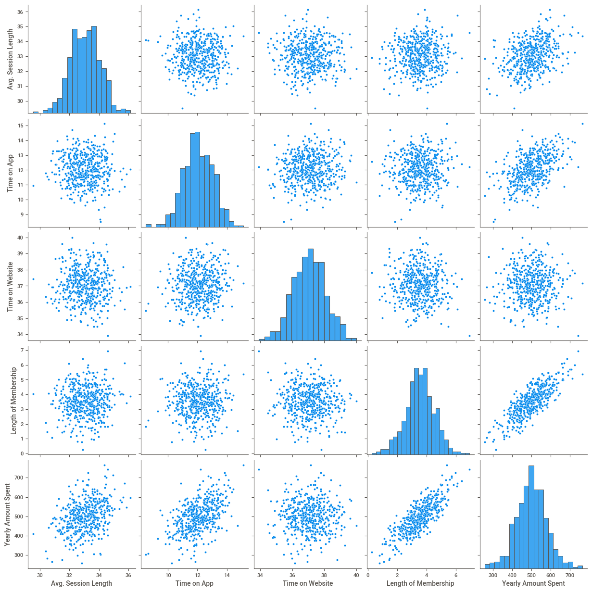
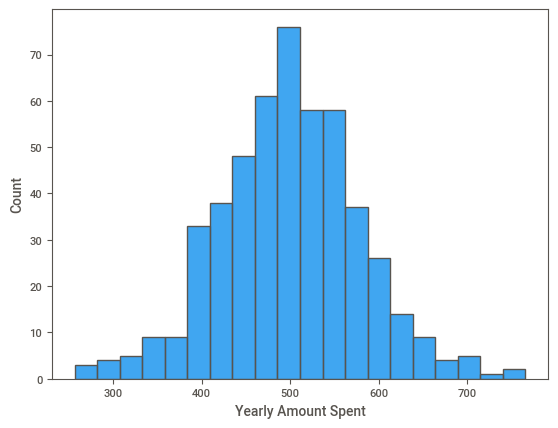
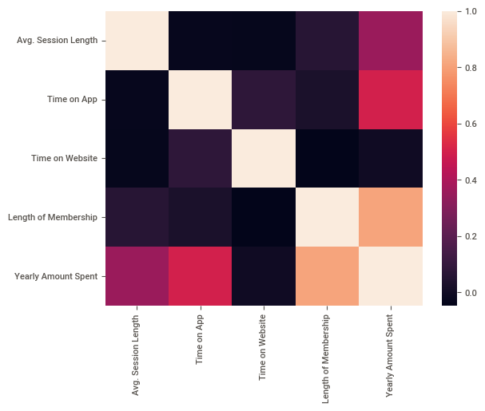
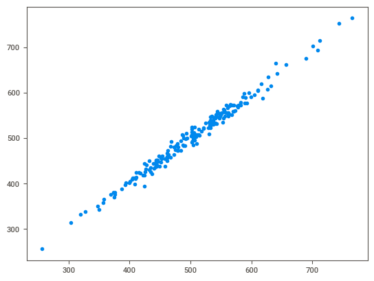
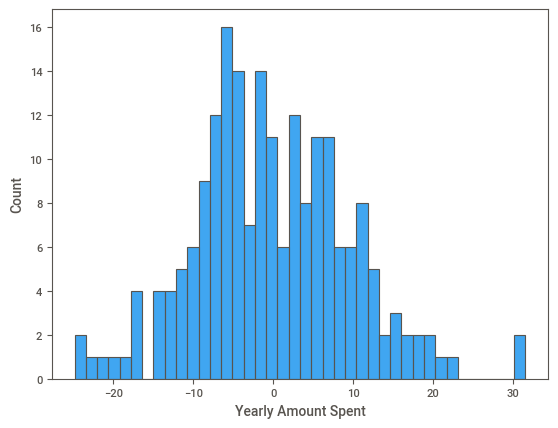
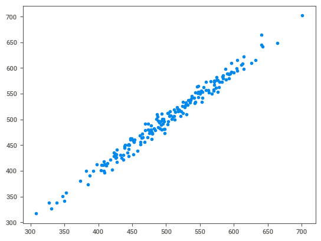
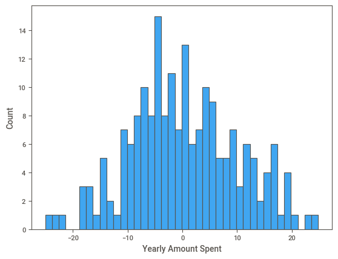

# Lab 6

### Group Members

| Names | ID |
| --- | --- |
| Arwa Alkhathlan | 2250030009 |
| Noor Albuainain | 2250030050 |
| Zainab Alharbi | 2250030246 |
| Joud Albeijan | 2250030261 |
| Sheehana Alghamdi | 2250030084 |
| Reem Alshehab | 2250030257 |


```python
# To ignore warnings
import warnings
warnings.filterwarnings("ignore")
import pandas as pd
import numpy as np
import matplotlib.pyplot as plt
import seaborn as sns


from sklearn.model_selection import train_test_split
from sklearn import metrics
from sklearn.linear_model import LinearRegression
from ydata_profiling import ProfileReport
import sweetviz as sv
```

## 1. Load the dataset into a DataFrame


```python
df_EC = pd.read_csv('Ecommerce Customers.csv')
```

# EDA

## 2. Explore the data (head, info, describe)

### head


```python
df_EC.head()
```


<table border="1" class="dataframe">
  <thead>
    <tr style="text-align: right;">
      <th></th>
      <th>Email</th>
      <th>Address</th>
      <th>Avatar</th>
      <th>Avg. Session Length</th>
      <th>Time on App</th>
      <th>Time on Website</th>
      <th>Length of Membership</th>
      <th>Yearly Amount Spent</th>
    </tr>
  </thead>
  <tbody>
    <tr>
      <th>0</th>
      <td>mstephenson@fernandez.com</td>
      <td>835 Frank Tunnel\nWrightmouth, MI 82180-9605</td>
      <td>Violet</td>
      <td>34.497268</td>
      <td>12.655651</td>
      <td>39.577668</td>
      <td>4.082621</td>
      <td>587.951054</td>
    </tr>
    <tr>
      <th>1</th>
      <td>hduke@hotmail.com</td>
      <td>4547 Archer Common\nDiazchester, CA 06566-8576</td>
      <td>DarkGreen</td>
      <td>31.926272</td>
      <td>11.109461</td>
      <td>37.268959</td>
      <td>2.664034</td>
      <td>392.204933</td>
    </tr>
    <tr>
      <th>2</th>
      <td>pallen@yahoo.com</td>
      <td>24645 Valerie Unions Suite 582\nCobbborough, D...</td>
      <td>Bisque</td>
      <td>33.000915</td>
      <td>11.330278</td>
      <td>37.110597</td>
      <td>4.104543</td>
      <td>487.547505</td>
    </tr>
    <tr>
      <th>3</th>
      <td>riverarebecca@gmail.com</td>
      <td>1414 David Throughway\nPort Jason, OH 22070-1220</td>
      <td>SaddleBrown</td>
      <td>34.305557</td>
      <td>13.717514</td>
      <td>36.721283</td>
      <td>3.120179</td>
      <td>581.852344</td>
    </tr>
    <tr>
      <th>4</th>
      <td>mstephens@davidson-herman.com</td>
      <td>14023 Rodriguez Passage\nPort Jacobville, PR 3...</td>
      <td>MediumAquaMarine</td>
      <td>33.330673</td>
      <td>12.795189</td>
      <td>37.536653</td>
      <td>4.446308</td>
      <td>599.406092</td>
    </tr>
  </tbody>
</table>
</div>


### info


```python
df_EC.info()
```

    <class 'pandas.core.frame.DataFrame'>
    RangeIndex: 500 entries, 0 to 499
    Data columns (total 8 columns):
     #   Column                Non-Null Count  Dtype  
    ---  ------                --------------  -----  
     0   Email                 500 non-null    object 
     1   Address               500 non-null    object 
     2   Avatar                500 non-null    object 
     3   Avg. Session Length   500 non-null    float64
     4   Time on App           500 non-null    float64
     5   Time on Website       500 non-null    float64
     6   Length of Membership  500 non-null    float64
     7   Yearly Amount Spent   500 non-null    float64
    dtypes: float64(5), object(3)
    memory usage: 31.4+ KB
    

### describe


```python
df_EC.describe()
```


<div>
<table border="1" class="dataframe">
  <thead>
    <tr style="text-align: right;">
      <th></th>
      <th>Avg. Session Length</th>
      <th>Time on App</th>
      <th>Time on Website</th>
      <th>Length of Membership</th>
      <th>Yearly Amount Spent</th>
    </tr>
  </thead>
  <tbody>
    <tr>
      <th>count</th>
      <td>500.000000</td>
      <td>500.000000</td>
      <td>500.000000</td>
      <td>500.000000</td>
      <td>500.000000</td>
    </tr>
    <tr>
      <th>mean</th>
      <td>33.053194</td>
      <td>12.052488</td>
      <td>37.060445</td>
      <td>3.533462</td>
      <td>499.314038</td>
    </tr>
    <tr>
      <th>std</th>
      <td>0.992563</td>
      <td>0.994216</td>
      <td>1.010489</td>
      <td>0.999278</td>
      <td>79.314782</td>
    </tr>
    <tr>
      <th>min</th>
      <td>29.532429</td>
      <td>8.508152</td>
      <td>33.913847</td>
      <td>0.269901</td>
      <td>256.670582</td>
    </tr>
    <tr>
      <th>25%</th>
      <td>32.341822</td>
      <td>11.388153</td>
      <td>36.349257</td>
      <td>2.930450</td>
      <td>445.038277</td>
    </tr>
    <tr>
      <th>50%</th>
      <td>33.082008</td>
      <td>11.983231</td>
      <td>37.069367</td>
      <td>3.533975</td>
      <td>498.887875</td>
    </tr>
    <tr>
      <th>75%</th>
      <td>33.711985</td>
      <td>12.753850</td>
      <td>37.716432</td>
      <td>4.126502</td>
      <td>549.313828</td>
    </tr>
    <tr>
      <th>max</th>
      <td>36.139662</td>
      <td>15.126994</td>
      <td>40.005182</td>
      <td>6.922689</td>
      <td>765.518462</td>
    </tr>
  </tbody>
</table>
</div>


```python
df_EC.describe(include='object').T
```


<div>
<table border="1" class="dataframe">
  <thead>
    <tr style="text-align: right;">
      <th></th>
      <th>count</th>
      <th>unique</th>
      <th>top</th>
      <th>freq</th>
    </tr>
  </thead>
  <tbody>
    <tr>
      <th>Email</th>
      <td>500</td>
      <td>500</td>
      <td>mstephenson@fernandez.com</td>
      <td>1</td>
    </tr>
    <tr>
      <th>Address</th>
      <td>500</td>
      <td>500</td>
      <td>835 Frank Tunnel\nWrightmouth, MI 82180-9605</td>
      <td>1</td>
    </tr>
    <tr>
      <th>Avatar</th>
      <td>500</td>
      <td>138</td>
      <td>Teal</td>
      <td>7</td>
    </tr>
  </tbody>
</table>
</div>


### Shape


```python
df_EC.shape
```


    (500, 8)


### duplicated


```python
df_EC.duplicated().sum()
```


    np.int64(0)


```python
df_EC[df_EC.duplicated()]
```


<div>
<table border="1" class="dataframe">
  <thead>
    <tr style="text-align: right;">
      <th></th>
      <th>Email</th>
      <th>Address</th>
      <th>Avatar</th>
      <th>Avg. Session Length</th>
      <th>Time on App</th>
      <th>Time on Website</th>
      <th>Length of Membership</th>
      <th>Yearly Amount Spent</th>
    </tr>
  </thead>
  <tbody>
  </tbody>
</table>
</div>


### null


```python
df_EC.isnull().sum()
```


    Email                   0
    Address                 0
    Avatar                  0
    Avg. Session Length     0
    Time on App             0
    Time on Website         0
    Length of Membership    0
    Yearly Amount Spent     0
    dtype: int64


### Outliers?


```python
report = sv.analyze(df_EC)
report.show_html('report.html')
```


[Report](report.html)

```python
num_cols = df_EC.select_dtypes(include='number').columns

fig, axes = plt.subplots(1, len(num_cols), figsize=(18, 4))
for ax, col in zip(axes, num_cols):
    sns.boxplot(y=df_EC[col], ax=ax)
    ax.set_title(col)
plt.tight_layout()
plt.show()
```


    

    


```python
def iqr_outliers(df, cols):
    rows = []
    for col in cols:
        q1 = df[col].quantile(0.25)
        q3 = df[col].quantile(0.75)
        iqr = q3 - q1
        lower = q1 - 1.5 * iqr
        upper = q3 + 1.5 * iqr
        mask = (df[col] < lower) | (df[col] > upper)
        rows.append({
            'Feature': col,
            'Q1': q1, 'Q3': q3, 'IQR': iqr,
            'Lower Bound': lower, 'Upper Bound': upper,
            'Outlier Count': mask.sum(),
            'Outlier %': round(mask.mean() * 100, 2)
        })
    return pd.DataFrame(rows).set_index('Feature')

iqr_summary = iqr_outliers(df_EC, num_cols)
iqr_summary
```


<div>
<table border="1" class="dataframe">
  <thead>
    <tr style="text-align: right;">
      <th></th>
      <th>Q1</th>
      <th>Q3</th>
      <th>IQR</th>
      <th>Lower Bound</th>
      <th>Upper Bound</th>
      <th>Outlier Count</th>
      <th>Outlier %</th>
    </tr>
    <tr>
      <th>Feature</th>
      <th></th>
      <th></th>
      <th></th>
      <th></th>
      <th></th>
      <th></th>
      <th></th>
    </tr>
  </thead>
  <tbody>
    <tr>
      <th>Avg. Session Length</th>
      <td>32.341822</td>
      <td>33.711985</td>
      <td>1.370163</td>
      <td>30.286577</td>
      <td>35.767230</td>
      <td>3</td>
      <td>0.6</td>
    </tr>
    <tr>
      <th>Time on App</th>
      <td>11.388153</td>
      <td>12.753850</td>
      <td>1.365696</td>
      <td>9.339609</td>
      <td>14.802394</td>
      <td>4</td>
      <td>0.8</td>
    </tr>
    <tr>
      <th>Time on Website</th>
      <td>36.349257</td>
      <td>37.716432</td>
      <td>1.367175</td>
      <td>34.298495</td>
      <td>39.767195</td>
      <td>2</td>
      <td>0.4</td>
    </tr>
    <tr>
      <th>Length of Membership</th>
      <td>2.930450</td>
      <td>4.126502</td>
      <td>1.196052</td>
      <td>1.136371</td>
      <td>5.920580</td>
      <td>12</td>
      <td>2.4</td>
    </tr>
    <tr>
      <th>Yearly Amount Spent</th>
      <td>445.038277</td>
      <td>549.313828</td>
      <td>104.275551</td>
      <td>288.624951</td>
      <td>705.727153</td>
      <td>9</td>
      <td>1.8</td>
    </tr>
  </tbody>
</table>
</div>


### Visulaiziton


```python
sns.pairplot(df_EC)
```


    <seaborn.axisgrid.PairGrid at 0x1a6f9824d70>


    

    


```python
sns.histplot(df_EC['Yearly Amount Spent'])
```


    <Axes: xlabel='Yearly Amount Spent', ylabel='Count'>


    

    


```python
sns.heatmap(df_EC.select_dtypes(include='number').corr())
```


    <Axes: >


    

    


## 3. Perform basic data cleaning if needed

since the IQR outlier showed a tiny bit of outliers most of them are less then 1%, 
i think they will not affect the model as much really, but just in case i looked into the 
two coulmns that had more then 1% outliers and i made df_clean. 
i will compare the original df_EC with df_clean. 


```python
cols = ['Length of Membership', 'Yearly Amount Spent']
q1, q3 = df_EC[cols].quantile(0.25), df_EC[cols].quantile(0.75)
iqr = q3 - q1
mask = ~((df_EC[cols] < q1 - 1.5*iqr) | (df_EC[cols] > q3 + 1.5*iqr)).any(axis=1)

df_clean = df_EC[mask]
print(len(df_EC), len(df_clean))
```

    500 483
    

## 4. Apply feature engineering (if applicable)

no need 

# this is for df_EC which has outliers

## 5. Prepare the data for modeling

### X and y arrays


```python
X = df_EC[['Avg. Session Length','Time on App', 'Time on Website','Length of Membership']]
y = df_EC['Yearly Amount Spent']
```

### Train Test Split


```python
X_train, X_test, y_train, y_test = train_test_split(X, y, test_size=0.4, random_state=101)
```

## 6. Train a model (use the same model used in the lab)


```python
lm = LinearRegression()
lm.fit(X_train,y_train)
```


<div id="sk-container-id-1" class="sk-top-container"><div class="sk-text-repr-fallback"><pre>LinearRegression()</pre><b>In a Jupyter environment, please rerun this cell to show the HTML representation or trust the notebook. <br />On GitHub, the HTML representation is unable to render, please try loading this page with nbviewer.org.</b></div><div class="sk-container" hidden><div class="sk-item"><div class="sk-estimator fitted sk-toggleable"><input class="sk-toggleable__control sk-hidden--visually" id="sk-estimator-id-1" type="checkbox" checked><label for="sk-estimator-id-1" class="sk-toggleable__label fitted sk-toggleable__label-arrow"><div><div>LinearRegression</div></div><div><a class="sk-estimator-doc-link fitted" rel="noreferrer" target="_blank" href="https://scikit-learn.org/1.6/modules/generated/sklearn.linear_model.LinearRegression.html">?<span>Documentation for LinearRegression</span></a><span class="sk-estimator-doc-link fitted">i<span>Fitted</span></span></div></label><div class="sk-toggleable__content fitted"><pre>LinearRegression()</pre></div> </div></div></div></div>


## 7. Evaluate the model performance


```python
print(lm.intercept_)
```

    -1045.1152168245749
    

### Predictions from Model


```python
predictions = lm.predict(X_test)
```


```python
plt.scatter(y_test,predictions)
```


    <matplotlib.collections.PathCollection at 0x1a681f72850>


    

    


### Residual Histogram


```python
sns.histplot((y_test-predictions),bins=40);
```


    

    


### Regression Evaluation Metrics


```python
print('MAE:', metrics.mean_absolute_error(y_test, predictions))
print('MSE:', metrics.mean_squared_error(y_test, predictions))
print('RMSE:', np.sqrt(metrics.mean_squared_error(y_test, predictions)))
```

    MAE: 7.74267128583873
    MSE: 93.83297800820075
    RMSE: 9.68674238370159
    

# this is for df_clean which has no outliers

## 5. Prepare the data for modeling

### X and y arrays


```python
X = df_clean[['Avg. Session Length','Time on App', 'Time on Website','Length of Membership']]
y = df_clean['Yearly Amount Spent']
```

### Train Test Split


```python
X_train, X_test, y_train, y_test = train_test_split(X, y, test_size=0.4, random_state=101)
```

## 6. Train a model (use the same model used in the lab)


```python
lm = LinearRegression()
lm.fit(X_train,y_train)
```


<div id="sk-container-id-2" class="sk-top-container"><div class="sk-text-repr-fallback"><pre>LinearRegression()</pre><b>In a Jupyter environment, please rerun this cell to show the HTML representation or trust the notebook. <br />On GitHub, the HTML representation is unable to render, please try loading this page with nbviewer.org.</b></div><div class="sk-container" hidden><div class="sk-item"><div class="sk-estimator fitted sk-toggleable"><input class="sk-toggleable__control sk-hidden--visually" id="sk-estimator-id-2" type="checkbox" checked><label for="sk-estimator-id-2" class="sk-toggleable__label fitted sk-toggleable__label-arrow"><div><div>LinearRegression</div></div><div><a class="sk-estimator-doc-link fitted" rel="noreferrer" target="_blank" href="https://scikit-learn.org/1.6/modules/generated/sklearn.linear_model.LinearRegression.html">?<span>Documentation for LinearRegression</span></a><span class="sk-estimator-doc-link fitted">i<span>Fitted</span></span></div></label><div class="sk-toggleable__content fitted"><pre>LinearRegression()</pre></div> </div></div></div></div>


## 7. Evaluate the model performance


```python
print(lm.intercept_)
```

    -1021.1136327185666
    


```python
coeff_df = pd.DataFrame(lm.coef_,X.columns,columns=['Coefficient'])
coeff_df
```


<div>
<table border="1" class="dataframe">
  <thead>
    <tr style="text-align: right;">
      <th></th>
      <th>Coefficient</th>
    </tr>
  </thead>
  <tbody>
    <tr>
      <th>Avg. Session Length</th>
      <td>25.392249</td>
    </tr>
    <tr>
      <th>Time on App</th>
      <td>38.354591</td>
    </tr>
    <tr>
      <th>Time on Website</th>
      <td>0.046250</td>
    </tr>
    <tr>
      <th>Length of Membership</th>
      <td>61.458660</td>
    </tr>
  </tbody>
</table>
</div>


### Predictions from Model


```python
predictions = lm.predict(X_test)
```


```python
plt.scatter(y_test,predictions)
```


    <matplotlib.collections.PathCollection at 0x1a684339bd0>


    

    


### Residual Histogram


```python
sns.histplot((y_test-predictions),bins=40);
```


    

    


### Regression Evaluation Metrics


```python
print('MAE:', metrics.mean_absolute_error(y_test, predictions))
print('MSE:', metrics.mean_squared_error(y_test, predictions))
print('RMSE:', np.sqrt(metrics.mean_squared_error(y_test, predictions)))
```

    MAE: 7.84340031096673
    MSE: 94.77942233524055
    RMSE: 9.735472373503022
    

# conclusion

**Model 1** is better.

All three metrics (MAE, MSE, and RMSE) measure prediction error, so lower values indicate higher accuracy. Model 1 achieves lower error across all metrics:

| Metric | Model 1 | Model 2 | Difference (Model 1 Advantage) |
| --- | --- | --- | --- |
| **MAE** | **7.7427** | 7.8434 | ~1.28% lower error |
| **MSE** | **93.8330** | 94.7794 | ~1.00% lower error |
| **RMSE** | **9.6867** | 9.7355 | ~0.50% lower error |

does that weirdly means with outliers it's better? 
no i think because the outliers are needed since they do represnt real 
actual behavior of top spenders, rather than bad data.
when we removed the ouliers it reduced prediction accuracy. espically because 
the outlier percent was less then 5% even it was barley anything so removing it made the
model worst
